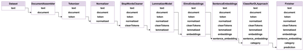
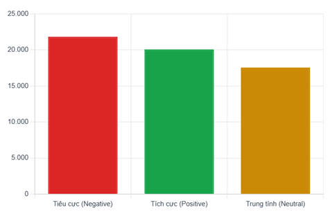
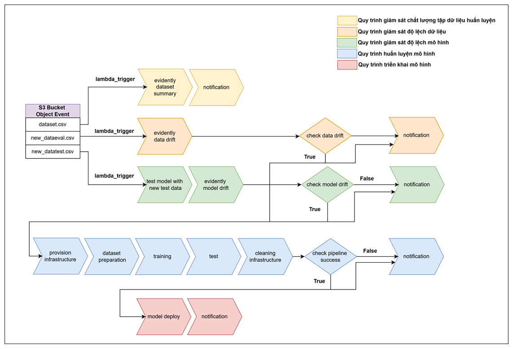

# MLOps System for Sentiment Analysis in Brand Monitoring 

This repository contains the implementation of the MLOps system designed to support the entire lifecycle of a sentiment analysis model, including training, evaluation, deployment, monitoring, and retraining. It is part of our undergraduate thesis:

> **Thesis Title:** Enhancing Sentiment Analysis in Brand Monitoring through MLOps  
> **Authors:** Trần Chức Thiện (21521464), Nguyễn Trần Bảo Quốc (21520421)  
> **University:** University of Information Technology - VNU-HCM  
> **Advisor:** Th.S. Lê Anh Tuấn  
> **Year:** 2025

## 🎯 Objective

Design and implement an MLOps pipeline that automates the lifecycle of a deep learning-based sentiment analysis model used in brand monitoring. The system focuses on detecting **data drift** and **model drift**, with mechanisms for automatic alerts and retraining.

> The application logic for sentiment analysis is implemented in the [app repository](https://github.com/TonyQ2k3/twitter-sentiment-analysis).

---

## 🧠 Features

### ✅ Experiment Management
- Track experiments, hyperparameters, metrics, and model versions using **MLflow**.
- Store and visualize model performance with **DagsHub** integration.

### 📊 Monitoring
- Detect **data drift** and **model drift** using **Evidently AI**.
- Generate monitoring reports and trigger alerts when performance degrades.

### 🔁 Automation
- Automated pipelines for:
  - Data collection and preprocessing
  - Model training and evaluation
  - Model deployment and redeployment
- Manual and automatic triggers for retraining when drift is detected.

### 🛠️ Infrastructure
- Infrastructure-as-code with **Terraform**.
- CI/CD with **GitHub Actions** for training, testing, and deployment.
- Deployed on **Kubernetes (Amazon EKS)** with scalable architecture.

---

## 🗂️ System Components

| Component            | Description |
|----------------------|-------------|
| `data-crawler`       | Collects user comments from Reddit via API |
| `spark-nlp`          | Processes data using Spark and pre-trained NLP models |
| `mlflow`             | Manages model experiments and versions |
| `evidently`          | Monitors drift and model performance |
| `terraform`          | Provisions and tears down infrastructure dynamically |
| `github-actions`     | Triggers CI/CD pipelines for MLOps workflows |
| `mongodb` + `redis`  | Stores user, comment, and model monitoring data |

---

## 📌 Use Case

This MLOps pipeline supports a brand monitoring application where:
- Businesses can request sentiment analysis on product discussions.
- The system analyzes social media comments to track customer sentiment.
- Model performance is constantly monitored and updated when degradation is detected.

---

## 🛠️ Implementation

### 🧪 Model Pipeline Design
The sentiment analysis model is built using Spark NLP, leveraging a modular and sequential processing pipeline composed of various annotators. Each component in the pipeline performs a specific transformation and passes annotated data to the next stage, allowing for high flexibility and observability. Intermediate results are stored in separate columns of the Spark DataFrame, making debugging and optimization easier.
DocumentAssembler: Converts raw text into a standard document format for pipeline processing.
> **Source code:** src/_02_training_olmo.py

- Tokenizer: Splits text into individual words and punctuation, improving model accuracy.
- Normalizer: Cleans tokens (lowercase, removes unwanted characters) to reduce vocabulary and improve generalization.
- StopWordsCleaner: Removes common, low-value words to improve classification performance.
- LemmatizerModel: Reduces words to their base forms, enhancing embedding quality and sentiment classification accuracy.
- ElmoEmbeddings: Creates context-sensitive word embeddings, improving NLP accuracy.
- SentenceEmbeddings: Combines word embeddings into a single vector representing the entire sentence for better classification features.
- ClassifierDLApproach: A deep learning text classifier (TensorFlow) that uses contextual sentence embeddings (ELMo, USE, BERT) for superior multi-class classification.

- Finisher: Extracts and formats classifier output into simple data types for Spark DataFrames, storage, or visualization.

## 📚 Dataset

In this thesis, we used the **[Twitter Entity Sentiment Analysis](https://www.kaggle.com/datasets/jp797498e/twitter-entity-sentiment-analysis) dataset** from Kaggle for model training and evaluation. This dataset is widely adopted in social media sentiment analysis research due to its rich and challenging characteristics. It features:

- Varied text lengths
- Informal language (e.g., slang, abbreviations)
- Noisy and sarcastic expressions

These characteristics make preprocessing a critical step, requiring sophisticated natural language processing techniques.

The dataset has been cited in numerous academic studies across traditional machine learning and advanced deep learning models, including Transformer-based architectures such as **BERT** and **RoBERTa**.

### 🛠 Dataset Adaptation

To better suit our goal — analyzing sentiments in Reddit comments — we adapted the dataset with custom preprocessing steps. The final cleaned dataset consists of **59,497 samples**, with two main columns:
- `text`: the user comment
- `label`: the sentiment class

### 📊 Label Distribution

| Sentiment   | Samples | Percentage |
|-------------|---------|------------|
| Negative    | 21,839  | 37%        |
| Positive    | 20,084  | 34%        |
| Neutral     | 17,574  | 30%        |

### 🔁 MLOps Pipeline Design

The MLOps system is designed to automate and monitor the entire model lifecycle:
> **Source code:** .github/workflows || Actions tab

- **Training Pipeline**:
  - Triggered via GitHub Actions or retraining policy
  - Runs ETL, model training, evaluation, and version registration with MLflow

- **Drift Monitoring Pipeline**:
  - Periodic batch job checks **data drift** and **model drift** with Evidently
  - Sends alert emails and triggers retraining pipeline when drift is detected

- **Deployment Pipeline**:
  - Model is not served as a live API due to batch nature
  - Instead, predictions are run as Spark jobs that query the model registry

---

## 📊 Demo
[Sentiment Analysis App](https://drive.google.com/drive/folders/1zbzuHu6E-wpt1gFHNUFDru76rGdWTFLK?usp=drive_link)

[MLOPS Pipeline](https://drive.google.com/drive/folders/1zbzuHu6E-wpt1gFHNUFDru76rGdWTFLK?usp=drive_link)

[Slide](https://docs.google.com/presentation/d/1V2FpFb9PYclmO05hL58izT-8hG-gv1D9/edit?usp=sharing&ouid=114523770070488171003&rtpof=true&sd=true)

---
## 📁 Related Repositories

- 🔍 [Sentiment Analysis App](https://github.com/TonyQ2k3/twitter-sentiment-analysis)

---

## 📄 License

This project is licensed under the [MIT License](LICENSE).

## 📬 Contact

For questions or collaboration inquiries, please contact:
- **Trần Chức Thiện** — 21521464@gm.uit.edu.vn
- **Nguyễn Trần Bảo Quốc** — 21520421@gm.uit.edu.vn

